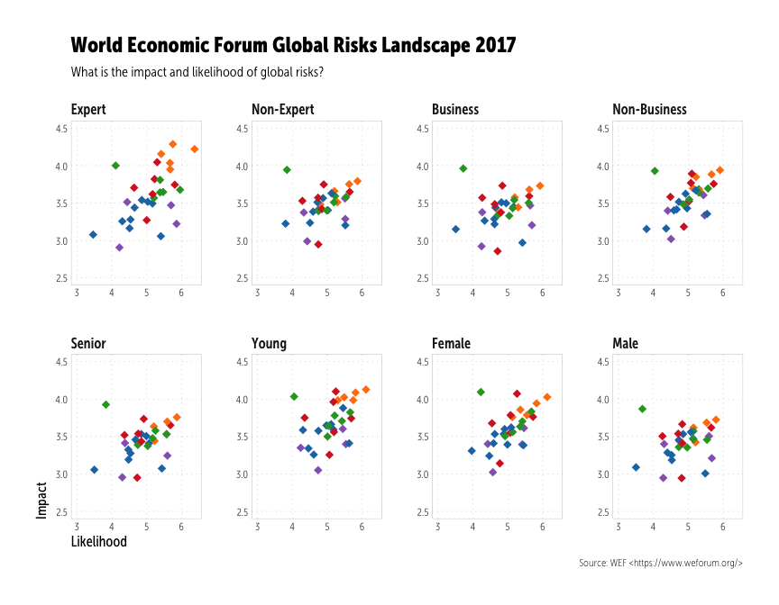

# WEF 2017 Global Risks Survey
  
  


```r
library(tidyverse)
library(hrbrmisc)
library(ggrepel)
```


### This is the cleaned/combined data


```r
wef2017_risks <- read_csv(file.path(rprojroot::find_rstudio_root_file(),
                                    "data", "wef2017risks.csv"),
                          col_types="ccddccc")
```

First we look at the macro-squishy-view:


```r
risk_1 <- filter(wef2017_risks, group == "Overall")
risk_rects <- data_frame(
  xmin=c(3, 4, 5), xmax=c(4, 5, 6),
  ymin=c(3, 3, 3), ymax=c(4, 4, 4)
)
```

```r
ggplot() +
  geom_rect(data=risk_rects, aes_all(names(risk_rects)), fill="#b2b2b266", color="#b2b2b255") +
  geom_point(data=risk_1, aes(likelihood, impact, color=category), shape=18, size=3) +
  geom_text_repel(data=risk_1, aes(likelihood, impact, label=risk),
                  segment.colour="#2b2b2b", segment.size=0.25,
                  size=2.25, family="MuseoSansCond-300") +
  scale_x_continuous(name="Likelihood", breaks=c(1:7), limits=c(1,7), expand=c(0,0)) +
  scale_y_continuous(name="Impact", breaks=c(1:5), limits=c(1,5), expand=c(0,0)) +
  ggthemes::scale_color_tableau() +
  coord_equal() +
  labs(title="World Economic Forum Global Risks Landscape 2017",
       subtitle="What is the impact and likelihood of global risks?",
       caption="Source: WEF <https://www.weforum.org/>") +
  theme_wef3()
```

<!-- -->

Now we look at the zoomed-in group view vs the macro-group view


```r
wef2017_risks %>%
  filter(group != "Overall") %>%
  mutate(group=factor(group, levels=c("Expert", "Non-Expert", "Business", "Non-Business",
                                      "Senior", "Young", "Female", "Male"))) -> risk_by
```

```r
ggplot(risk_by, aes(likelihood, impact, color=category)) +
  geom_point(shape=18, size=3) +
  scale_x_continuous(name="Likelihood", limits=c(3, 6.4)) +
  scale_y_continuous(name="Impact", breaks=seq(2.5, 4.5, 0.5), limits=c(2.5, 4.5)) +
  ggthemes::scale_color_tableau() +
  facet_wrap(~group, ncol=4, scales="free") +
  coord_equal() +
  labs(title="World Economic Forum Global Risks Landscape 2017",
       subtitle="What is the impact and likelihood of global risks?",
       caption="Source: WEF <https://www.weforum.org/>") +
  theme_wef()
```

<!-- -->

```r
ggplot(risk_by, aes(likelihood, impact, color=category)) +
  geom_point(shape=18, size=3) +
  scale_x_continuous(name="Likelihood", breaks=c(1:7), limits=c(1,7)) +
  scale_y_continuous(name="Impact", breaks=c(1:5), limits=c(1,5)) +
  ggthemes::scale_color_tableau() +
  facet_wrap(~group, ncol=4, scales="free") +
  coord_equal() +
  labs(title="World Economic Forum Global Risks Landscape 2017",
       subtitle="What is the impact and likelihood of global risks?",
       caption="Source: WEF <https://www.weforum.org/>") +
  theme_wef()
```

<!-- -->

Lastly, we compate the ratings between the "opposites":


```r
filter(risk_by, group %in% c("Expert", "Business", "Senior", "Female")) %>%
  mutate(group=factor(group, levels=c("Expert", "Business", "Senior", "Female")),
         meta_group=as.numeric(group)) %>%
  arrange(group, risk) %>%
  mutate(left_value=impact*likelihood) %>%
  select(risk, left_group=group, left_value) %>%
  bind_cols(
    filter(risk_by, group %in% c("Non-Expert", "Non-Business", "Young", "Male")) %>%
      mutate(group=factor(group, levels=c("Non-Expert", "Non-Business", "Young", "Male")),
             meta_group=as.numeric(group)) %>%
      arrange(group, risk) %>%
      mutate(right_value=impact*likelihood) %>%
      select(-risk, right_group=group, right_value)) %>%
  mutate(facet=sprintf("%s vs %s", left_group, right_group)) -> risk_groups
```

```r
ggplot(risk_groups, aes(x=left_group, xend=right_group, y=left_value, yend=right_value, color=category)) +
  geom_segment(size=0.25) +
  scale_x_discrete(name=NULL, expand=c(0,0)) +
  scale_y_continuous(name="Risk score", limits=c(10,27)) +
  ggthemes::scale_color_tableau(name=NULL) +
  facet_wrap(~facet, scales="free", ncol=4) +
  labs(title="World Economic Forum Global Risks Landscape 2017",
       subtitle="Risk score ranges between source groups (risk = likelihood x impact)",
       caption="Source: WEF <https://www.weforum.org/>") +
  theme_wef2()
```

<!-- -->

```r
ggplot(risk_groups, aes(x=left_group, xend=right_group, y=left_value, yend=right_value, color=category)) +
  geom_segment(size=0.25) +
  scale_x_discrete(name=NULL, expand=c(0,0)) +
  scale_y_continuous(name="Risk score", limits=c(1,49)) +
  ggthemes::scale_color_tableau(name=NULL) +
  facet_wrap(~facet, scales="free", ncol=4) +
  labs(title="World Economic Forum Global Risks Landscape 2017",
       subtitle="Risk score ranges between source groups (risk = likelihood x impact)",
       caption="Source: WEF <https://www.weforum.org/>") +
  theme_wef2()
```

<!-- -->


---
title: "devils_in_the_davos.R"
author: "bob"
date: "Mon Jan 16 17:51:43 2017"
---
